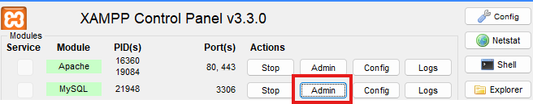

# WhatsDown Messaging Web Application -Web Programming Project

An amateur-ish kind of whatsapp, in which you can search users and add them to your contacts list or remove them, you can send text messages/hidden text messages/images/hidden images, 
you can set the chat's wallpaper, you can set the wallpaper's color, set a dark-light theme. Everything is saved on a MySQL database. 


## Technical Details

This web app uses only vanilla JavaScript, HTML, CSS & Bootstrap for the front-end. The back-end is written in PHP. The web app is hosted using XAMPP locally. It makes use of the Apache 
server for running PHP scripts and MySQL server for hosting the database. The front-end is split into two javascript files, one for the login page and one for the rest of the app. In the back-end,
each server request has its own php script associated with it, so there's a bunch of them inside the php_scripts folder.

## Setting it Up

### 1. Installing XAMPP
Check the official [page](https://www.apachefriends.org/) for the right version for you.

### 2. Cloning this Repository

First you have to go into the terminal, move to the directory of the xampp app and then go into htdocs by running:

```powershell
cd xampp/htdocs

git clone https://github.com/mmswflow-upb/WhatsDown-IWP-Project.git
```

### 3. Running the App
Run the xampp app, then click on the start buttons adjacent to "Apache" & "MySQL", the web application should be running now.

### 4. Entering the Database Admin Page
Click on the "admin" button next to "MySQL", you will be directed to a PHPMyAdmin page. 



### 5. Creating the Database for the App
